# Meditation Centre Rota Manager

[](https://github.com/Meditationzencode/Meditation-Centre-Rota-Manager/actions/workflows/ci.yml)
[](https://nextjs.org)
[](https://www.typescriptlang.org)
[](LICENSE)
[](https://sangha-rota.vercel.app/login)

**A full-stack rota management web application for a Buddhist meditation centre.**

🔗 **Live demo: [sangha-rota.vercel.app](https://sangha-rota.vercel.app/login)** &middot; **Demo accounts below — one click and you're in.**

Most small community organisations run their volunteer rota out of a shared spreadsheet, with shift swaps happening in a group chat nobody can find later. Names get lost, no-shows go unrecorded, and one person ends up chasing everyone else.

**Sangha Rota replaces that with a single web app.** Volunteers self-serve sign-ups from a weekly calendar, request swaps with a reason, and submit unavailability in advance. Coordinators build the schedule (one-off slots or weekly recurring templates) and approve swap requests. Admins manage members, audit every action, and see the whole system at a glance from a dashboard.

Built as a portfolio project to demonstrate full-stack engineering end-to-end — from PostgreSQL schema design and Row-Level Security policies through to a deployed, installable PWA with real-time updates.

**By the numbers:**
- **7 PostgreSQL tables** with Row-Level Security on every one
- **4 user roles** with three independent layers of access control (database, middleware, server actions)
- **50 Playwright end-to-end tests** covering auth, permissions, CRUD, and the full swap lifecycle
- **18+ screens** across desktop and mobile breakpoints, all captured below
- **Deployed live on Vercel** — try it without cloning a thing

All data is entirely fictional — no real organisation information is included.

---

## Table of contents

- [Screenshots](#screenshots)
- [Try the live demo](#try-the-live-demo)
- [Tech stack](#tech-stack)
- [Features](#features)
- [Why I built this](#why-i-built-this)
- [Technical decisions](#technical-decisions)
- [Getting started](#getting-started)
- [Deploying to Vercel](#deploying-to-vercel)
- [Role permissions](#role-permissions)
- [Database design](#database-design)
- [Project structure](#project-structure)
- [Security and privacy](#security-and-privacy)
- [Testing](#testing)
- [What I learned](#what-i-learned)
- [Future improvements](#future-improvements)

## Screenshots

| Home | Login |
|------|-------|
| 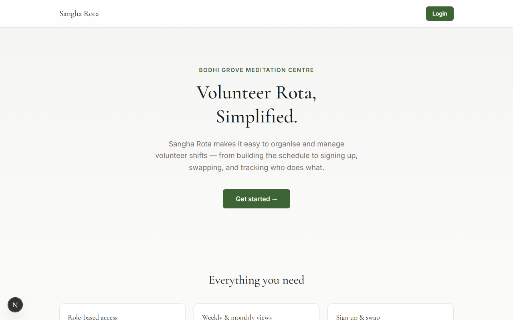 | 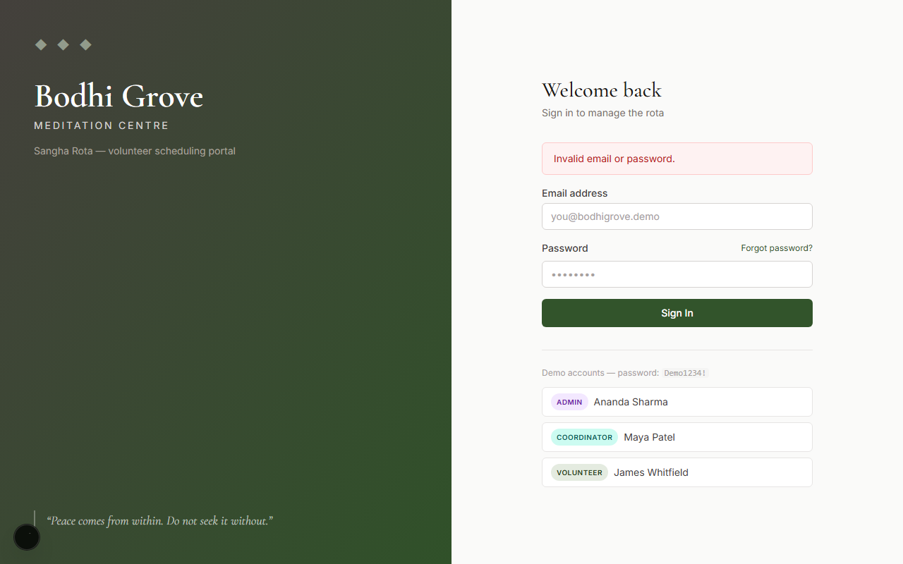 |

| Dashboard | Profile |
|-----------|---------|
|  | 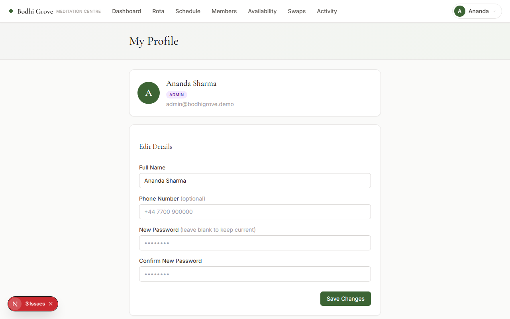 |

| Weekly rota | Monthly rota |
|-------------|--------------|
|  |  |

| Shift detail | Create shift |
|--------------|--------------|
|  | 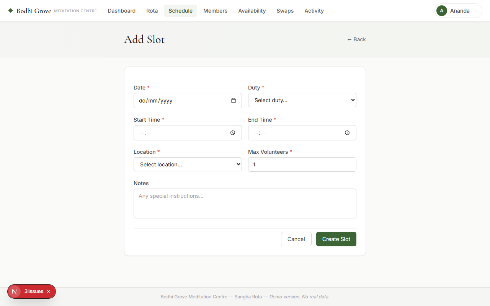 |

| Edit shift | Recurring schedule |
|------------|--------------------|
| 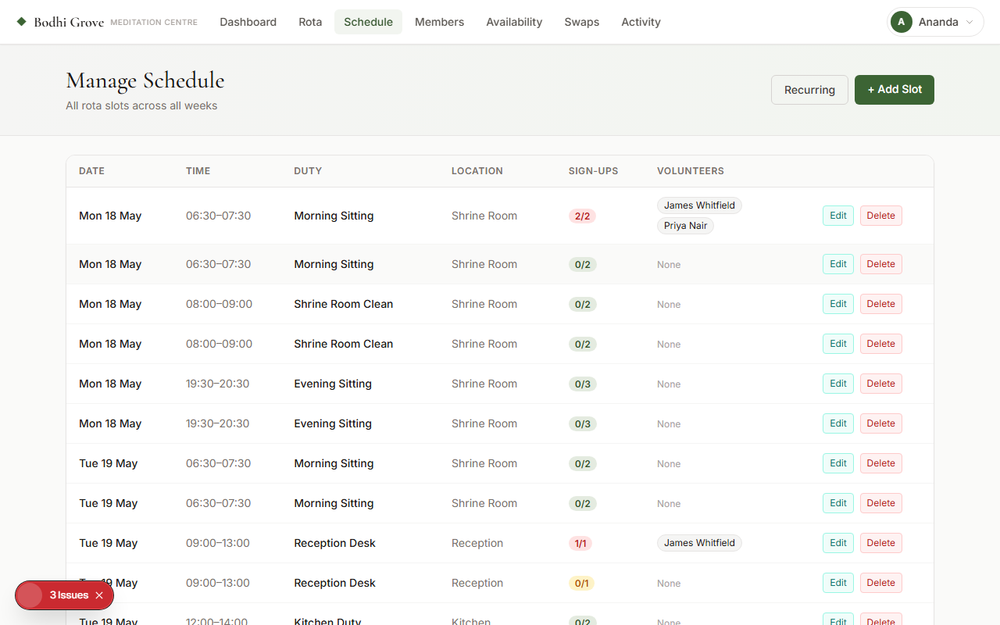 | 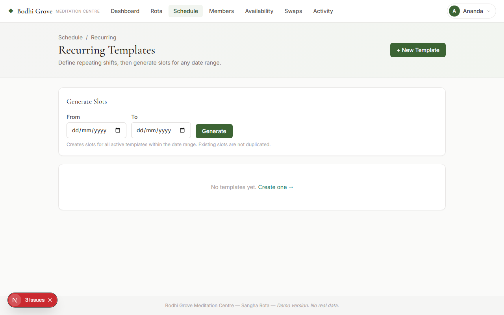 |

| Member management | Edit member |
|-------------------|-------------|
|  | 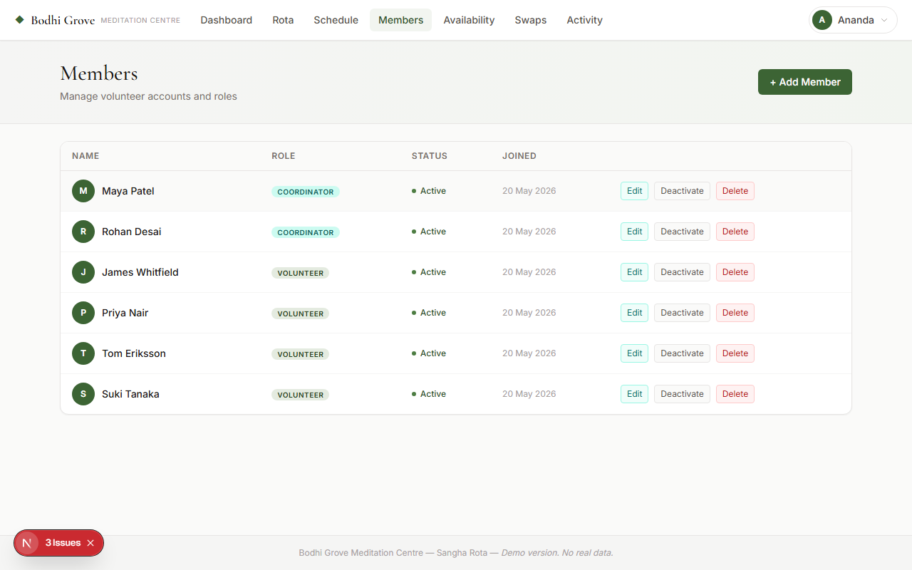 |

| Swap requests | Activity log |
|---------------|--------------|
| 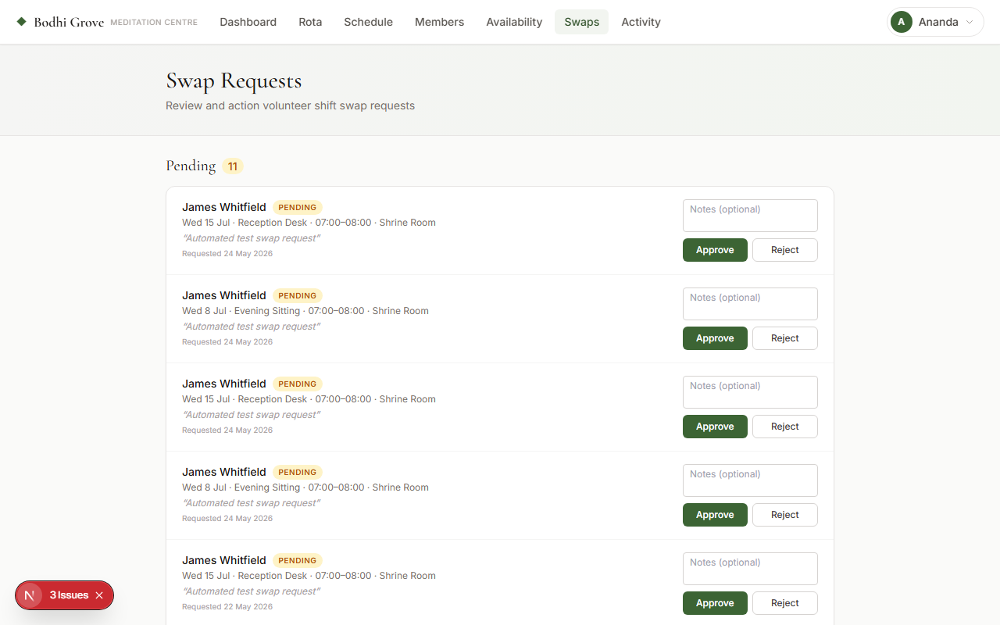 | 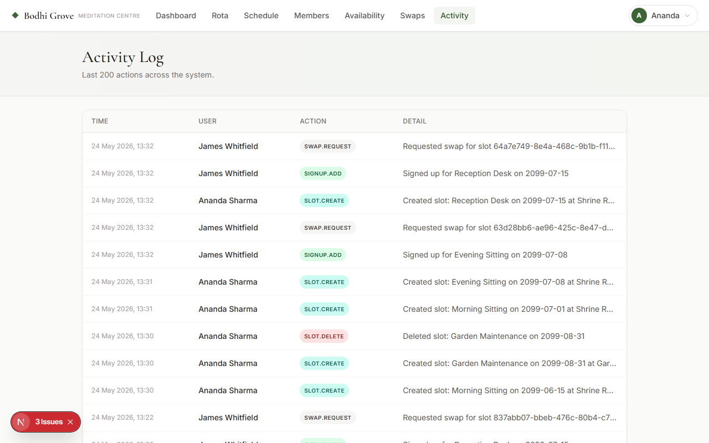 |

| Member availability | Add member |
|---------------------|------------|
| 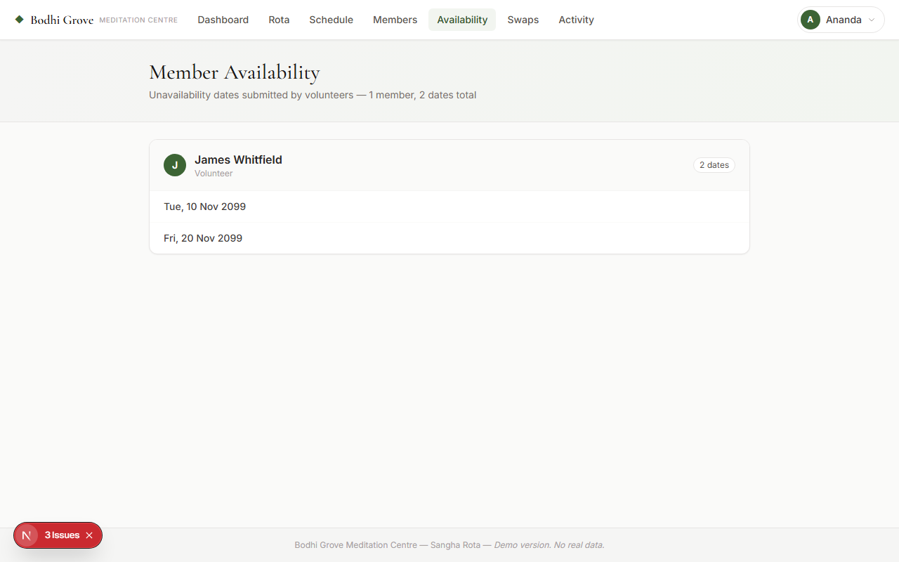 | 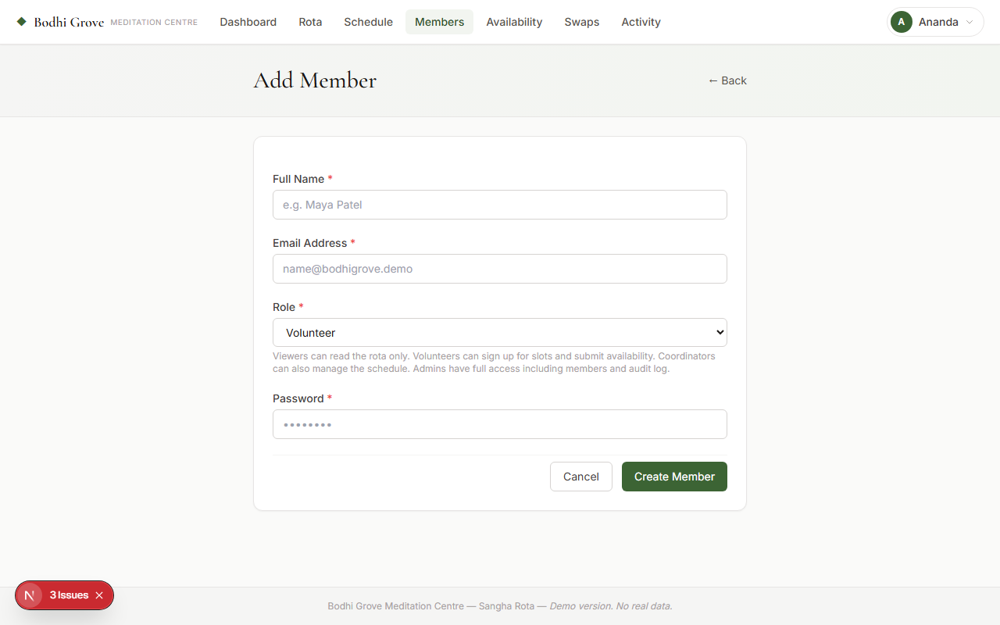 |

| Mobile dashboard | Mobile rota |
|------------------|-------------|
| 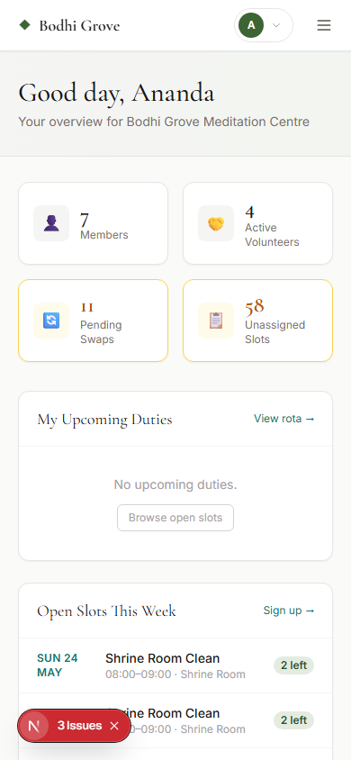 | 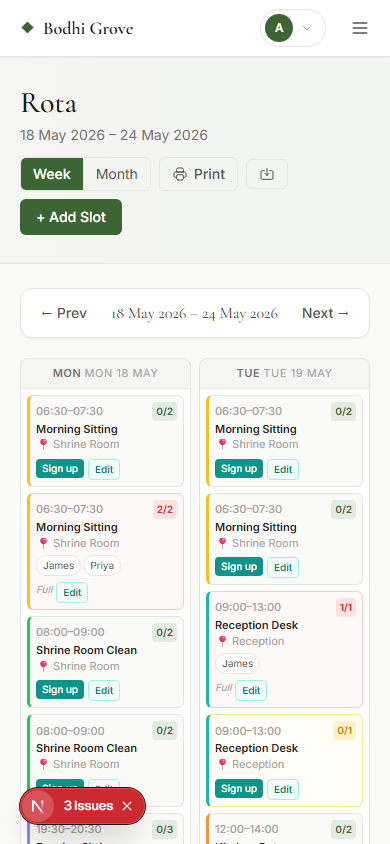 |

---

### Try the live demo

| Role | Email | Password |
|---|---|---|
| Admin | `admin@bodhigrove.demo` | `Demo1234!` |
| Coordinator | `coord1@bodhigrove.demo` | `Demo1234!` |
| Volunteer | `vol1@bodhigrove.demo` | `Demo1234!` |

---

## Tech stack

| Layer        | Choice                              |
|--------------|-------------------------------------|
| Framework    | Next.js 15 (App Router)             |
| Language     | TypeScript                          |
| Auth         | Supabase Auth (email/password)      |
| Database     | PostgreSQL via Supabase             |
| ORM / client | Supabase JS client + `@supabase/ssr`|
| Styling      | Tailwind CSS                        |
| Deployment   | Vercel                              |

## Features

- **Authentication** — Supabase Auth with session cookies (SSR-safe); password hashing handled by Supabase's bcrypt-based auth
- **Role-based access** — four roles (admin, coordinator, volunteer, viewer) enforced in middleware, UI, and at the database level via Row Level Security
- **Weekly rota calendar** — browse by week, view duties, locations, sign-up counts; interactive sign-up and cancel
- **Monthly rota calendar** — full month grid view with slot previews per day; click any day to jump to that week
- **Volunteer sign-up / cancel** — one-click via React Server Actions
- **Shift swap requests** — volunteers request swaps; admins approve (auto-cancels the signup) or reject; full audit trail
- **Volunteer availability** — volunteers submit unavailability by date range and time
- **Schedule management** — coordinators and admins create, edit, and delete slots with validated forms
- **Member management** — admins create accounts, assign roles, and activate or deactivate users
- **Admin dashboard** — stat cards for members, active volunteers, pending swap requests, and unassigned upcoming slots
- **Form validation** — required fields, valid email format, start time before end time (client-side and server-side), minimum password length
- **Audit log** — every significant action is recorded with the acting user and timestamp

---

## Why I built this

Many small community organisations rely on spreadsheets or manual messages to manage volunteer rotas. This project was built to solve that problem with a centralised web application that handles scheduling, availability, and swap requests in one place.

---

## Technical decisions

Every architectural choice in this project was deliberate. Here's the reasoning behind the ones that mattered most.

### Server Actions instead of a REST API layer

Next.js 15 Server Actions let me call a server function directly from a `<form>` element without writing an `/api/...` route, fetching with `useEffect`, managing loading state, or serialising/deserialising JSON. Every mutation in this app (sign up, cancel, request swap, approve swap, create slot, update profile) is a Server Action.

The trade-off: Server Actions only work inside Next.js, so the data layer isn't portable to another client. For a portfolio app with one frontend that's a non-issue, and I get less code, less ceremony, and full type safety end-to-end. `useActionState` gives me the result and pending status as a hook — no manual loading flags.

### Supabase Row-Level Security instead of middleware-only auth

Middleware checks "can this URL be accessed?" — but if I check authorization *only* in middleware or Server Actions, anyone with the Supabase anon key (which ships in the browser bundle) can bypass my app code and query the database directly.

RLS moves the access rules into Postgres itself. Even a direct query from a malicious client only returns rows that user is allowed to see, because the database evaluates a policy on every read and write. Middleware and Server Actions still do their own checks — defence in depth — but the database is the ultimate authority.

### No client-side state management library

There's no Redux, no Zustand, no React Query, no SWR. The app barely has any client state: server components fetch on the server, forms submit via Server Actions, and the server response triggers a re-render. The few genuinely client-side bits (the user dropdown, the inline swap form, the mobile nav) use plain `useState`.

For a CRUD app where the database is the source of truth, anything more would be overhead. Real-time updates use Supabase's WebSocket subscription to call `router.refresh()`, which re-runs the server component — no client cache to invalidate.

### React Server Components for almost everything

Every page in `app/` is a Server Component by default. They fetch data, run on the server, and ship zero JavaScript for that fetching logic to the browser. Client Components (`'use client'`) appear only where I need interactivity: the rota grid (Realtime subscription + Server Action forms), the nav (dropdown state), the swap-decision buttons.

This means the rota page, dashboard, profile, member list, audit log, etc. all load with minimal bundle weight. The browser only downloads JS for the interactive bits, not the data-fetching layer.

### Playwright for end-to-end tests over Jest / React Testing Library

For an app whose value lives in *workflows that span multiple pages and roles* (volunteer signs up → admin approves swap → signup is cancelled → audit log shows it), unit tests with mocked Supabase miss the most important class of bug: integration bugs where two layers each look correct in isolation but disagree about behaviour.

Playwright drives a real browser against a real Supabase instance. Tests fail when the actual user-facing behaviour breaks — which is the only thing that matters. The trade-off is slower test runs (the suite takes ~6 minutes), but the signal is far higher than 500 fast unit tests that all pass while the app is broken.

---

## Getting started

### 1. Clone & install

```bash
git clone https://github.com/Meditationzencode/Meditation-Centre-Rota-Manager
cd Meditation-Centre-Rota-Manager
npm install
```

### 2. Create a Supabase project

1. Go to [supabase.com](https://supabase.com) and create a free project.
2. In **Project Settings → API**, copy your **Project URL** and **anon key**.
3. Also copy the **service role key** (needed for admin user creation and swap approvals).

### 3. Configure environment variables

```bash
cp .env.local.example .env.local
```

Edit `.env.local` and fill in your values:

```env
NEXT_PUBLIC_SUPABASE_URL=https://your-project-ref.supabase.co
NEXT_PUBLIC_SUPABASE_ANON_KEY=your-anon-key
SUPABASE_SERVICE_ROLE_KEY=your-service-role-key
```

These variables are never committed to version control. The anon key is safe to expose to the browser; the service role key is server-side only.

### 4. Run the database setup

In the **Supabase SQL Editor**, run these files in order (the numeric prefix is the run order):

```
supabase/01_schema.sql         ← core tables (profiles, slots, signups) + auto-profile trigger
supabase/02_rls.sql            ← Row-Level Security policies + my_role() helper
supabase/03_shift_swaps.sql    ← shift_swaps table and its RLS policies
supabase/04_features.sql       ← unavailability and audit_log tables + RLS
supabase/05_recurring.sql      ← recurring_templates table + RLS
supabase/06_schema_v2.sql      ← later schema additions (phone, slot status, admin notes)
```

Then optionally run `supabase/07_seed.sql` for sample data, or skip it and run `npm run setup` (next step) to get the full demo dataset with auth users.

### 5. Seed the database

Run the setup script — it creates all demo auth users, profiles, rota slots, and sample signups automatically:

```bash
npm run setup
```

This creates the following demo accounts (password: `Demo1234!`):

| Email                       | Role        | Name            |
|-----------------------------|-------------|-----------------|
| admin@bodhigrove.demo       | Admin       | Ananda Sharma   |
| coord1@bodhigrove.demo      | Coordinator | Maya Patel      |
| coord2@bodhigrove.demo      | Coordinator | Rohan Desai     |
| vol1@bodhigrove.demo        | Volunteer   | James Whitfield |
| vol2@bodhigrove.demo        | Volunteer   | Priya Nair      |
| vol3@bodhigrove.demo        | Volunteer   | Tom Eriksson    |
| vol4@bodhigrove.demo        | Volunteer   | Suki Tanaka     |

### 6. Start the development server

```bash
npm run dev
# → http://localhost:3000
```

---

## Deploying to Vercel

```bash
vercel
```

Add the same three environment variables in **Vercel → Project → Settings → Environment Variables**.

Set the **Site URL** in Supabase Dashboard → Authentication → URL Configuration to your Vercel production URL.

---

## Role permissions

| Feature                              | Admin | Coordinator | Volunteer | Viewer |
|--------------------------------------|:-----:|:-----------:|:---------:|:------:|
| View rota (weekly and monthly)       | ✓     | ✓           | ✓         | ✓      |
| Sign up for / cancel slots           | ✓     | ✓           | ✓         | –      |
| Request shift swaps                  | ✓     | ✓           | ✓         | –      |
| Submit unavailability                | ✓     | ✓           | ✓         | –      |
| Create / edit / delete slots         | ✓     | ✓           | –         | –      |
| Approve / reject swap requests       | ✓     | –           | –         | –      |
| View all member accounts             | ✓     | –           | –         | –      |
| Create / edit / delete accounts      | ✓     | –           | –         | –      |
| View audit log                       | ✓     | –           | –         | –      |

## Database design

Seven PostgreSQL tables, every one with Row-Level Security enabled. Foreign keys cascade where appropriate so deletes don't leave orphan rows.

| Table | Purpose | Key relationships |
|---|---|---|
| `profiles` | Extends `auth.users` with name, phone, role, and active flag. A trigger auto-creates a row when a new auth user signs up. | One-to-one with `auth.users` |
| `slots` | A specific shift on a specific date — duty, location, time window, max volunteers, status (open / cancelled). | Referenced by `signups` and `shift_swaps` |
| `signups` | Which volunteer is signed up for which slot. Unique on `(slot_id, user_id)` to prevent double sign-ups. | Many-to-many bridge: `profiles` &harr; `slots` |
| `shift_swaps` | Volunteer-initiated requests to drop a shift, with a reason, status (pending / approved / rejected), reviewer, and admin notes. | Belongs to a `profile` (requester) and a `slot` |
| `unavailability` | Dates a volunteer has marked as unavailable. Unique on `(user_id, date)`. | Belongs to a `profile` |
| `recurring_templates` | Repeating shift definitions (e.g. "Morning Sitting, Mon/Wed/Fri at 07:00") used to bulk-generate `slots`. | Source for new `slots` rows |
| `audit_log` | Append-only record of every significant action: who, what, when, on which entity. Admin-readable only. | Foreign-keys the acting `profile` |

**Helper functions:**
- `my_role()` — a `SECURITY DEFINER` function used inside RLS policies to look up the caller's role without giving them permission to read or modify the `profiles.role` column directly.
- `handle_new_user()` — a trigger on `auth.users` that auto-inserts a matching `profiles` row, so every authenticated user always has a profile.

---

## Project structure

```
src/
├── app/
│   ├── (auth)/login/          ← sign-in page (no nav)
│   ├── (app)/                 ← protected layout with nav + footer
│   │   ├── dashboard/         ← overview with stat cards
│   │   ├── rota/              ← weekly calendar view
│   │   │   └── month/         ← monthly calendar view
│   │   ├── admin/
│   │   │   ├── schedule/      ← slot management (coordinator + admin)
│   │   │   ├── members/       ← user management (admin only)
│   │   │   ├── swaps/         ← swap request review (admin only)
│   │   │   └── activity/      ← audit log (admin only)
│   │   └── profile/
│   ├── api/auth/callback/     ← Supabase OAuth redirect handler
│   ├── layout.tsx             ← root HTML + fonts
│   └── globals.css
├── components/
│   ├── nav.tsx                ← sticky nav with role badge and user dropdown
│   ├── rota/rota-grid.tsx     ← 7-column interactive weekly calendar
│   └── ui/badge.tsx           ← role badge component
├── lib/
│   ├── actions.ts             ← all Server Actions (auth, rota, admin, swaps)
│   ├── supabase/
│   │   ├── client.ts          ← browser Supabase client
│   │   └── server.ts          ← server + admin Supabase clients
│   ├── types.ts
│   └── utils.ts
└── middleware.ts              ← session guard, redirects unauthenticated users

supabase/
├── 01_schema.sql              ← core tables (profiles, slots, signups) + trigger
├── 02_rls.sql                 ← Row-Level Security policies + my_role() helper
├── 03_shift_swaps.sql         ← shift_swaps table + RLS
├── 04_features.sql            ← unavailability and audit_log tables + RLS
├── 05_recurring.sql           ← recurring_templates table + RLS
├── 06_schema_v2.sql           ← later schema additions
└── 07_seed.sql                ← demo rota data
```

## Security and privacy

- **Password hashing** — Supabase Auth uses bcrypt internally; plaintext passwords are never stored or logged.
- **Environment variables** — secret keys (`SUPABASE_SERVICE_ROLE_KEY`) are server-side only and excluded from the browser bundle. The `.env.local` file is in `.gitignore` and never committed.
- **Row Level Security** — RLS is enabled on every table. Database access is enforced at the Postgres level regardless of application code, so a bug in server logic cannot leak another user's data.
- **Service role key scoping** — the admin (service role) client is only instantiated in server-side code for operations that legitimately require bypassing RLS (creating users, approving swaps). It is never accessible to the browser.
- **Protected admin routes** — middleware redirects unauthenticated requests to `/login`. Role checks in server components, server actions, and middleware prevent privilege escalation; e.g. only admins can reach `/admin/members` and `/admin/swaps`.
- **Form validation** — all forms validate required fields, email format, and time ordering (start before end) on both the client and server. Server Actions re-validate every input before touching the database.
- **Role immutability** — the `my_role()` SECURITY DEFINER function prevents volunteers from reading or modifying their own role via RLS policy bypass.
- **No secrets in version control** — `.env.local` and any file matching `.env*.local` are gitignored. The repository contains only `.env.local.example` with placeholder values.
- **Session cookies** — managed by `@supabase/ssr` with `httpOnly` and `sameSite: lax` attributes; not accessible to JavaScript.
- **Minimal data collection** — only name, email, role, availability, and shift assignments are stored; no home address, date of birth, or unnecessary contact details.

---

## Testing

The project includes tests for authentication, role-based permissions, shift CRUD actions, and form validation.

Key tested areas:
- Login and logout flow
- Protected routes
- Admin-only permissions
- Shift creation, editing and deletion
- Availability form validation

### Prerequisites

The tests hit `http://localhost:3000` by default, so the dev server must be running:

```bash
npm run dev
```

The demo accounts must also exist in your Supabase project — run `npm run setup` to create them.

### Commands

```bash
npm test              # headless, all tests (single worker)
npm run test:ui       # interactive Playwright UI
npm run test:report   # view the last HTML report
```

### Test accounts

| Env var | Default value | Notes |
|---------|---------------|-------|
| `TEST_ADMIN_EMAIL` | `admin@bodhigrove.demo` | |
| `TEST_ADMIN_PASSWORD` | `Demo1234!` | |
| `TEST_VOL_EMAIL` | `vol1@bodhigrove.demo` | |
| `TEST_VOL_PASSWORD` | `Demo1234!` | |
| `TEST_VIEWER_EMAIL` | *(unset)* | Create a member with role Viewer, then set this to enable the viewer permission test |
| `TEST_VIEWER_PASSWORD` | `Demo1234!` | |

Override any of these as environment variables before running tests. The base URL can be changed with `PLAYWRIGHT_BASE_URL`.

---

## What I learned

Three things stand out from building this — each one changed how I write code.

**1. Security has to live at the database, not the app.**
My first version did role checks inside Server Actions: "if profile.role === 'admin' then…". It worked. Then I realised the Supabase anon key is in the browser bundle — any user could open DevTools and query the database directly, bypassing my app code entirely. I rebuilt the data layer using Postgres Row-Level Security so that even a direct query with a volunteer's token can only return rows that volunteer is allowed to see. The app code became simpler too; I stopped writing the same `if` checks in every action because the database was already enforcing them.

**2. Tests that depend on shared state will lie to you.**
My swap-request tests passed in isolation but failed in the suite. The first slot the test created on `2099-07-01` worked once; the second run found that the test data from the previous run was still in the database, so the "first sign-up button" the test clicked belonged to a different slot. I learned to either reset state between tests, use unique data per run, or write the test so it doesn't care which slot it picks — and to add a retry loop when accumulated state is genuinely unavoidable. "Flaky tests" are almost always a bug in the test, not the framework.

**3. Server Actions made me stop reaching for an API layer by reflex.**
Coming from older React tutorials, my instinct was to write `/api/signups/route.ts`, fetch from the client, handle loading states, etc. Next.js 15 Server Actions let you call a server function directly from a `<form>` with `action={signUp}` — no API route, no `fetch`, no loading state to wire up. `useActionState` gives you the result and pending status as a hook. The mental shift was realising that "the network is an implementation detail" — I express *what* the user is doing, not *how* it travels across the wire.

## Future improvements

- **Waiting list** — when a slot is full, let volunteers join a queue and be notified if a space opens
- **Volunteer preference matching** — volunteers set preferred duties or times; admin sees suggestions when assigning
- **Bulk slot import** — CSV upload to create multiple slots at once for a new term or retreat
- **SMS reminders** — text-based shift reminders the day before, for volunteers who don't check email
- **Multi-centre support** — namespace slots, members, and templates under separate organisations
- **Shift notes from volunteers** — free-text field volunteers fill in after completing a shift
- **Recurring unavailability** — mark a recurring day (e.g. every Tuesday) rather than individual dates
- **CI pipeline** — run the Playwright suite on every pull request via GitHub Actions

---

*This is a fictional demo project. Bodhi Grove Meditation Centre does not exist.*
