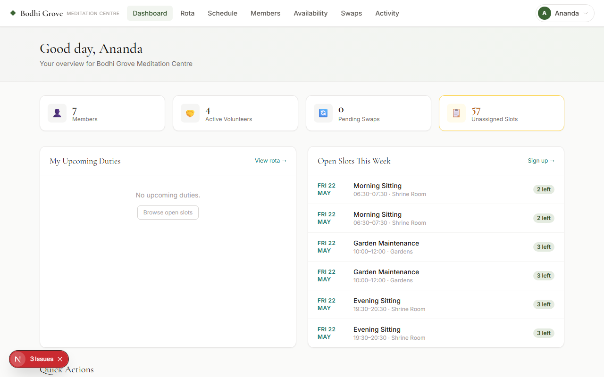
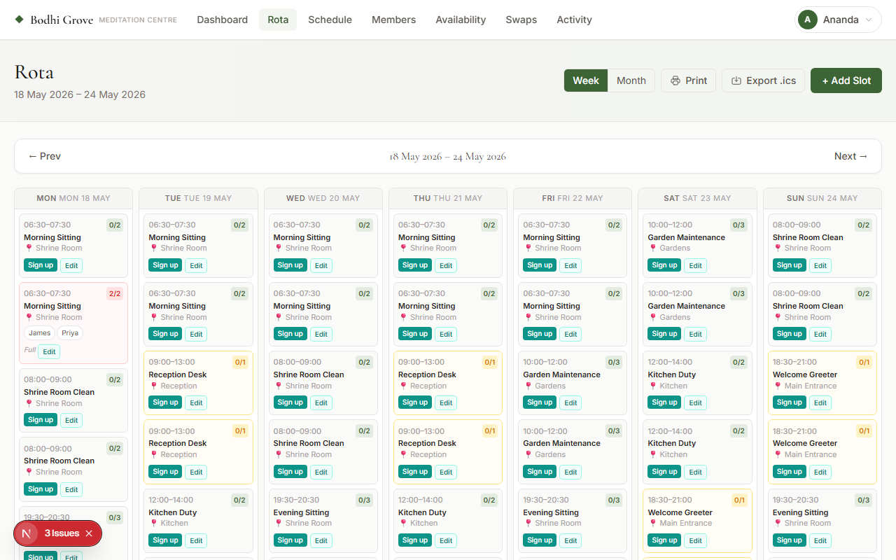
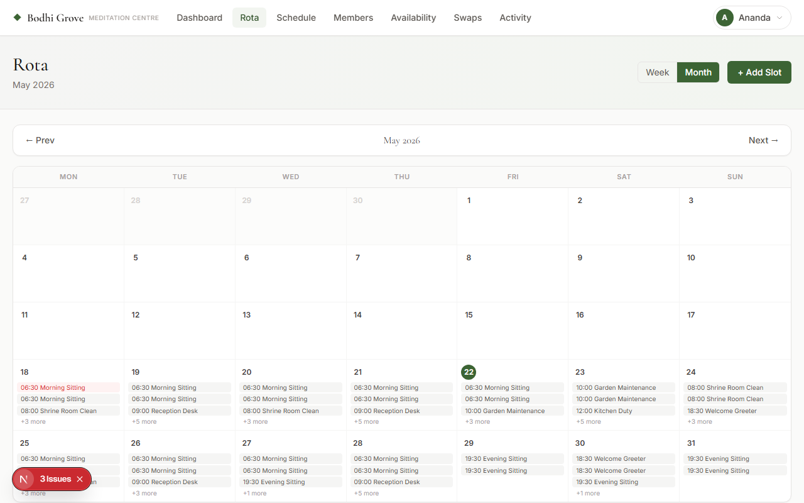
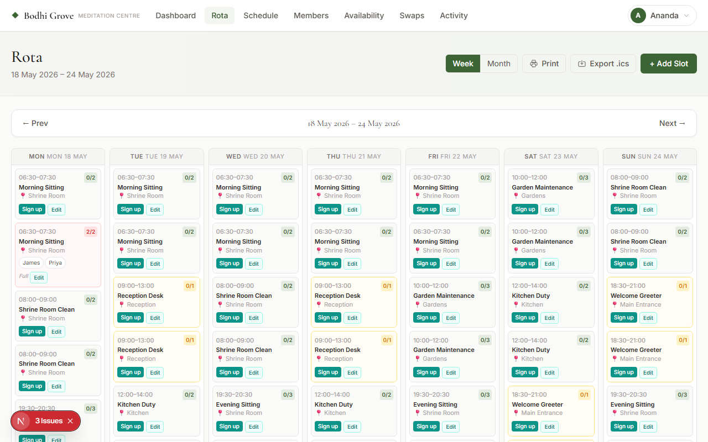
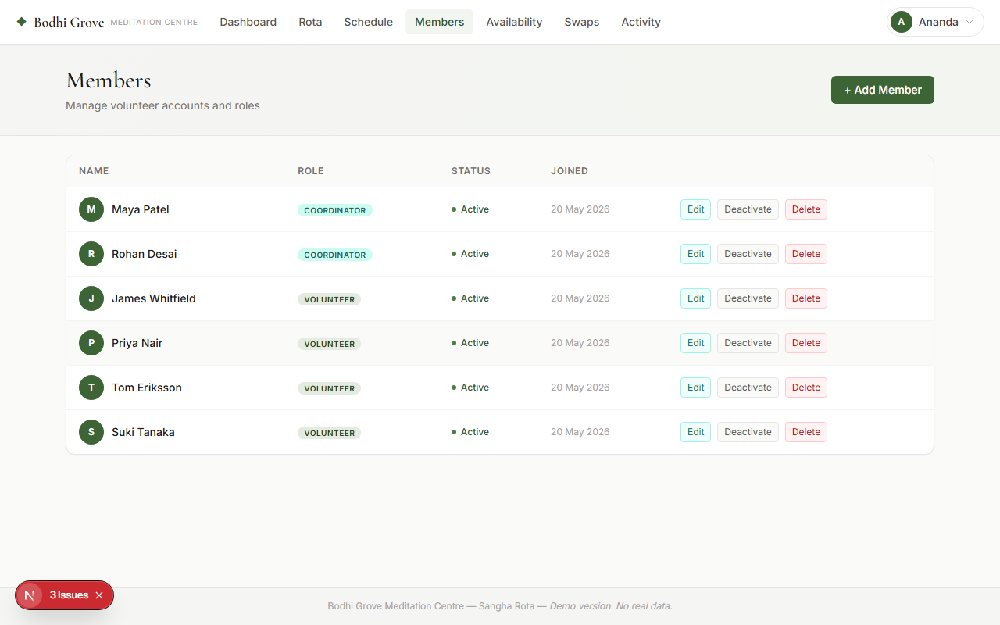

# Meditation Centre Rota Manager

**A full-stack rota management web application for a Buddhist meditation centre.**

🔗 **Live demo: [sangha-rota.vercel.app](https://sangha-rota.vercel.app/login)**

Meditation Centre Rota Manager is a database-backed scheduling web application designed to replace spreadsheet-based rota management for a Buddhist meditation centre. The application supports user authentication, role-based access control, shift creation, volunteer availability, weekly and monthly rota views, shift swap requests, and admin tools. It is designed with privacy, maintainability, and real-world usability in mind.

All data is entirely fictional — no real organisation information is included.

## Screenshots

| Dashboard | Weekly rota |
|-----------|-------------|
|  |  |

| Monthly rota | Shift detail |
|--------------|--------------|
|  |  |

| Manage schedule | Member management |
|-----------------|-------------------|
|  |  |

---

### Try the live demo

| Role | Email | Password |
|---|---|---|
| Admin | `admin@bodhigrove.demo` | `Demo1234!` |
| Coordinator | `coord1@bodhigrove.demo` | `Demo1234!` |
| Volunteer | `vol1@bodhigrove.demo` | `Demo1234!` |

---

## Tech stack

| Layer        | Choice                              |
|--------------|-------------------------------------|
| Framework    | Next.js 15 (App Router)             |
| Language     | TypeScript                          |
| Auth         | Supabase Auth (email/password)      |
| Database     | PostgreSQL via Supabase             |
| ORM / client | Supabase JS client + `@supabase/ssr`|
| Styling      | Tailwind CSS                        |
| Deployment   | Vercel                              |

## Features

- **Authentication** — Supabase Auth with session cookies (SSR-safe); password hashing handled by Supabase's bcrypt-based auth
- **Role-based access** — four roles (admin, coordinator, volunteer, viewer) enforced in middleware, UI, and at the database level via Row Level Security
- **Weekly rota calendar** — browse by week, view duties, locations, sign-up counts; interactive sign-up and cancel
- **Monthly rota calendar** — full month grid view with slot previews per day; click any day to jump to that week
- **Volunteer sign-up / cancel** — one-click via React Server Actions
- **Shift swap requests** — volunteers request swaps; admins approve (auto-cancels the signup) or reject; full audit trail
- **Volunteer availability** — volunteers submit unavailability by date range and time
- **Schedule management** — coordinators and admins create, edit, and delete slots with validated forms
- **Member management** — admins create accounts, assign roles, and activate or deactivate users
- **Admin dashboard** — stat cards for members, active volunteers, pending swap requests, and unassigned upcoming slots
- **Form validation** — required fields, valid email format, start time before end time (client-side and server-side), minimum password length
- **Audit log** — every significant action is recorded with the acting user and timestamp

---

## Getting started

### 1. Clone & install

```bash
git clone https://github.com/Meditationzencode/Meditation-Centre-Rota-Manager
cd Meditation-Centre-Rota-Manager
npm install
```

### 2. Create a Supabase project

1. Go to [supabase.com](https://supabase.com) and create a free project.
2. In **Project Settings → API**, copy your **Project URL** and **anon key**.
3. Also copy the **service role key** (needed for admin user creation and swap approvals).

### 3. Configure environment variables

```bash
cp .env.local.example .env.local
```

Edit `.env.local` and fill in your values:

```env
NEXT_PUBLIC_SUPABASE_URL=https://your-project-ref.supabase.co
NEXT_PUBLIC_SUPABASE_ANON_KEY=your-anon-key
SUPABASE_SERVICE_ROLE_KEY=your-service-role-key
```

These variables are never committed to version control. The anon key is safe to expose to the browser; the service role key is server-side only.

### 4. Run the database setup

In the **Supabase SQL Editor**, run these files in order:

```
supabase/schema.sql       ← tables, indexes, and the auto-profile trigger
supabase/rls.sql          ← Row Level Security policies
supabase/shift-swaps.sql  ← shift_swaps table and its RLS policies
```

### 5. Seed the database

Run the setup script — it creates all demo auth users, profiles, rota slots, and sample signups automatically:

```bash
npm run setup
```

This creates the following demo accounts (password: `Demo1234!`):

| Email                       | Role        | Name            |
|-----------------------------|-------------|-----------------|
| admin@bodhigrove.demo       | Admin       | Ananda Sharma   |
| coord1@bodhigrove.demo      | Coordinator | Maya Patel      |
| coord2@bodhigrove.demo      | Coordinator | Rohan Desai     |
| vol1@bodhigrove.demo        | Volunteer   | James Whitfield |
| vol2@bodhigrove.demo        | Volunteer   | Priya Nair      |
| vol3@bodhigrove.demo        | Volunteer   | Tom Eriksson    |
| vol4@bodhigrove.demo        | Volunteer   | Suki Tanaka     |

### 6. Start the development server

```bash
npm run dev
# → http://localhost:3000
```

---

## Deploying to Vercel

```bash
vercel
```

Add the same three environment variables in **Vercel → Project → Settings → Environment Variables**.

Set the **Site URL** in Supabase Dashboard → Authentication → URL Configuration to your Vercel production URL.

---

## Role permissions

| Feature                              | Admin | Coordinator | Volunteer | Viewer |
|--------------------------------------|:-----:|:-----------:|:---------:|:------:|
| View rota (weekly and monthly)       | ✓     | ✓           | ✓         | ✓      |
| Sign up for / cancel slots           | ✓     | ✓           | ✓         | –      |
| Request shift swaps                  | ✓     | ✓           | ✓         | –      |
| Submit unavailability                | ✓     | ✓           | ✓         | –      |
| Create / edit / delete slots         | ✓     | ✓           | –         | –      |
| Approve / reject swap requests       | ✓     | –           | –         | –      |
| View all member accounts             | ✓     | –           | –         | –      |
| Create / edit / delete accounts      | ✓     | –           | –         | –      |
| View audit log                       | ✓     | –           | –         | –      |

---

## Project structure

```
src/
├── app/
│   ├── (auth)/login/          ← sign-in page (no nav)
│   ├── (app)/                 ← protected layout with nav + footer
│   │   ├── dashboard/         ← overview with stat cards
│   │   ├── rota/              ← weekly calendar view
│   │   │   └── month/         ← monthly calendar view
│   │   ├── admin/
│   │   │   ├── schedule/      ← slot management (coordinator + admin)
│   │   │   ├── members/       ← user management (admin only)
│   │   │   ├── swaps/         ← swap request review (admin only)
│   │   │   └── activity/      ← audit log (admin only)
│   │   └── profile/
│   ├── api/auth/callback/     ← Supabase OAuth redirect handler
│   ├── layout.tsx             ← root HTML + fonts
│   └── globals.css
├── components/
│   ├── nav.tsx                ← sticky nav with role badge and user dropdown
│   ├── rota/rota-grid.tsx     ← 7-column interactive weekly calendar
│   └── ui/badge.tsx           ← role badge component
├── lib/
│   ├── actions.ts             ← all Server Actions (auth, rota, admin, swaps)
│   ├── supabase/
│   │   ├── client.ts          ← browser Supabase client
│   │   └── server.ts          ← server + admin Supabase clients
│   ├── types.ts
│   └── utils.ts
└── middleware.ts              ← session guard, redirects unauthenticated users

supabase/
├── schema.sql                 ← tables, indexes, auto-profile trigger
├── rls.sql                    ← Row Level Security policies
├── shift-swaps.sql            ← shift_swaps table and RLS
└── seed.sql                   ← demo rota data
```

## Security

- **Password hashing** — Supabase Auth uses bcrypt internally; plaintext passwords are never stored or logged.
- **Environment variables** — secret keys (`SUPABASE_SERVICE_ROLE_KEY`) are server-side only and excluded from the browser bundle. The `.env.local` file is in `.gitignore` and never committed.
- **Row Level Security** — RLS is enabled on every table. Database access is enforced at the Postgres level regardless of application code, so a bug in server logic cannot leak another user's data.
- **Service role key scoping** — the admin (service role) client is only instantiated in server-side code for operations that legitimately require bypassing RLS (creating users, approving swaps). It is never accessible to the browser.
- **Protected admin routes** — middleware redirects unauthenticated requests to `/login`. Role checks in every server component and server action prevent privilege escalation; e.g. only admins can reach `/admin/members` and `/admin/swaps`.
- **Form validation** — all forms validate required fields, email format, and time ordering (start before end) on both the client and server. Server Actions re-validate every input before touching the database.
- **Role immutability** — the `my_role()` SECURITY DEFINER function prevents volunteers from reading or modifying their own role via RLS policy bypass.
- **No secrets in version control** — `.env.local` and any file matching `.env*.local` are gitignored. The repository contains only `.env.local.example` with placeholder values.
- **Session cookies** — managed by `@supabase/ssr` with `httpOnly` and `sameSite: lax` attributes; not accessible to JavaScript.

---

## Running the tests

The project ships with a full end-to-end test suite (39 tests) built with [Playwright](https://playwright.dev/).

### Prerequisites

The tests hit `http://localhost:3000` by default, so the dev server must be running:

```bash
npm run dev
```

The demo accounts must also exist in your Supabase project — run `npm run setup` to create them.

### Commands

```bash
npm test              # headless, all tests (single worker)
npm run test:ui       # interactive Playwright UI
npm run test:report   # view the last HTML report
```

### Test accounts

| Env var | Default value |
|---------|---------------|
| `TEST_ADMIN_EMAIL` | `admin@bodhigrove.demo` |
| `TEST_ADMIN_PASSWORD` | `Demo1234!` |
| `TEST_VOL_EMAIL` | `vol1@bodhigrove.demo` |
| `TEST_VOL_PASSWORD` | `Demo1234!` |

Override any of these as environment variables before running tests. The base URL can be changed with `PLAYWRIGHT_BASE_URL`.

---

## Future improvements

- **Conflict detection** — warn when a volunteer is already assigned to an overlapping slot on the same day
- **Waiting list** — when a slot is full, let volunteers join a queue and be notified if a space opens
- **Volunteer preference matching** — volunteers set preferred duties or times; admin sees suggestions when assigning
- **Bulk slot import** — CSV upload to create multiple slots at once for a new term or retreat
- **Push notifications** — browser push API or SMS for shift reminders the day before
- **Mobile PWA** — add a web app manifest so volunteers can install the rota on their home screen
- **Multi-centre support** — namespace slots, members, and templates under separate organisations
- **Shift notes from volunteers** — free-text field volunteers fill in after completing a shift
- **Recurring unavailability** — mark a recurring day (e.g. every Tuesday) rather than individual dates

---

*This is a fictional demo project. Bodhi Grove Meditation Centre does not exist.*
